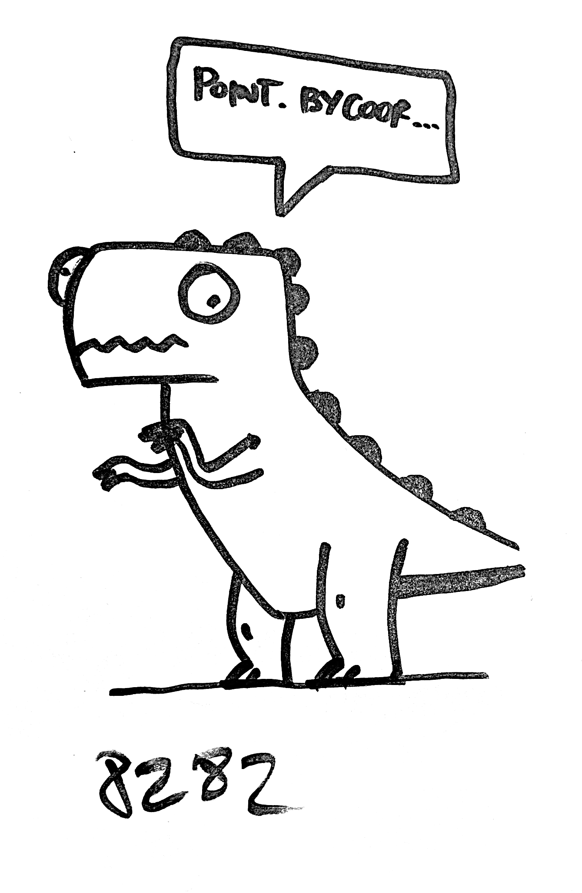
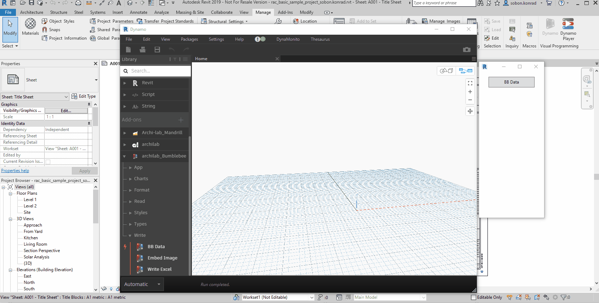
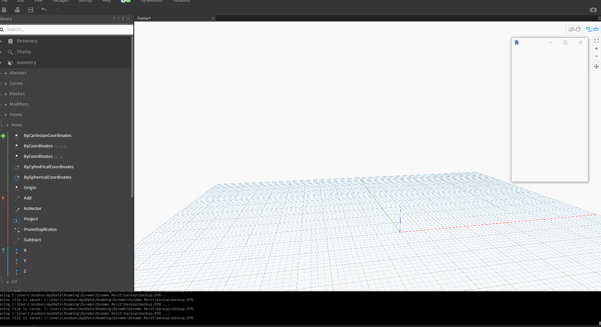

# the-Saurus

## TT Hackathon 2018 Project

**"Autocomplete" for [Dynamo](https://github.com/DynamoDS/Dynamo) based on statistical/machine learning models.** Please see the Project [**Presentation**](https://docs.google.com/presentation/d/1EypGPF-okLQuuB9NaoL1U_KaERHPjp_yM9HmP2DQKu0/edit?usp=sharing) Page for more details

**Team:**
Ahmed Abbas
[Petr Mitev](https://github.com/mitevpi)
[Patrick Pease](https://github.com/patpease)
[Konrad Sobon](https://github.com/ksobon)
[Aaron Tang](https://github.com/QilongTang)
[Varvara Toulkeridou](https://github.com/varvaratou)
Jasmine Wright

The very basic workflow:

The advanced workflow:

## Data Models

[**Training Data**](Data/Output/graphData.csv)

| Node A Name                     | Node B Name                               | Node A ID                        | Node B ID                        |
| ------------------------------- | ----------------------------------------- | -------------------------------- | -------------------------------- |
| DSCore.List.Transpose@var[]..[] | DSCore.List.GetItemAtIndex@var[]..[]\_int | b76189ba8c4a49dd875ddc88e806d5df | a2d2a3d30ff14eaaa120993bca904c53 |

[**Custom Package Data**](Data/Output/packageData.csv)

| GUID                                 | NAME                              | PATH                                                                                                            |
| ------------------------------------ | --------------------------------- | --------------------------------------------------------------------------------------------------------------- |
| ecdb3729-0de2-4c50-bdca-28fe881027a2 | Springs.FamilyInstance.ByGeometry | C:\Users\pmitev\AppData\Roaming\Dynamo\Dynamo Revit\2.1\packages\spring nodes\dyf\FamilyInstance.ByGeometry.dyf |

[**"Hyper"-Featurized Data (WIP)**](Data/Output/graphDataFeaturized.csv)

| Node A Name | Node B Name | # Connections to Unique | # Connections Total | Custom? | Core? | ZT?  |
| ----------- | ----------- | ----------------------- | ------------------- | ------- | ----- | ---- |
| string      | string      | int                     | int                 | bool    | bool  | bool |
